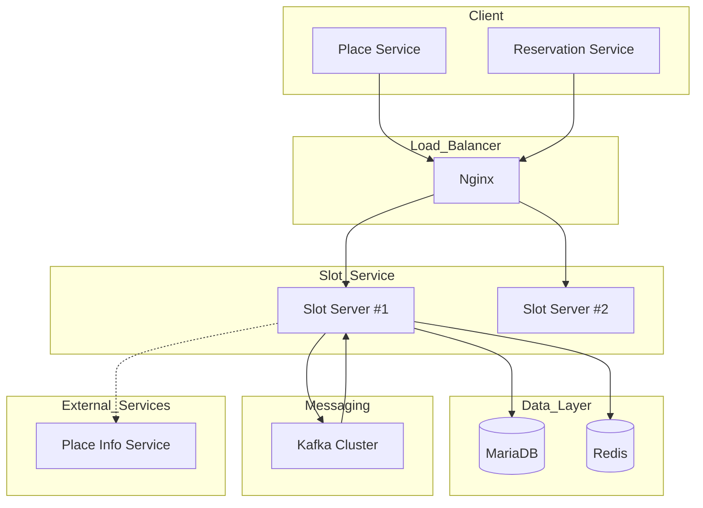
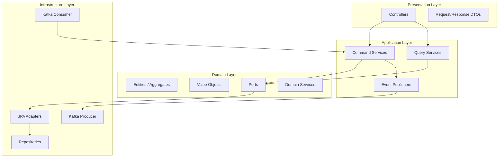
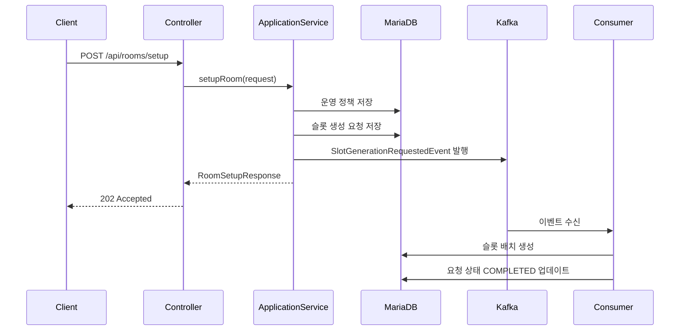
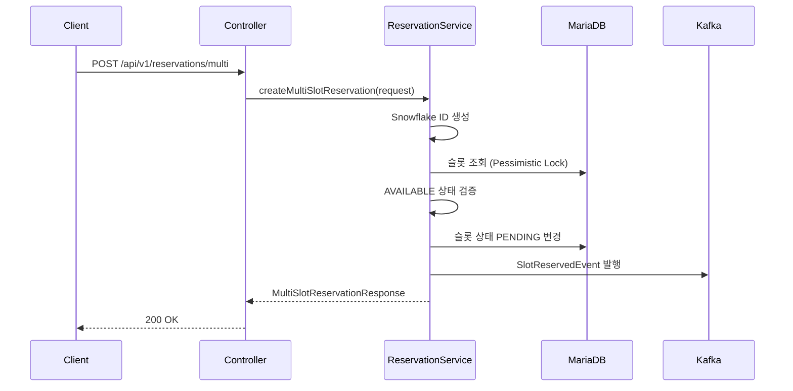
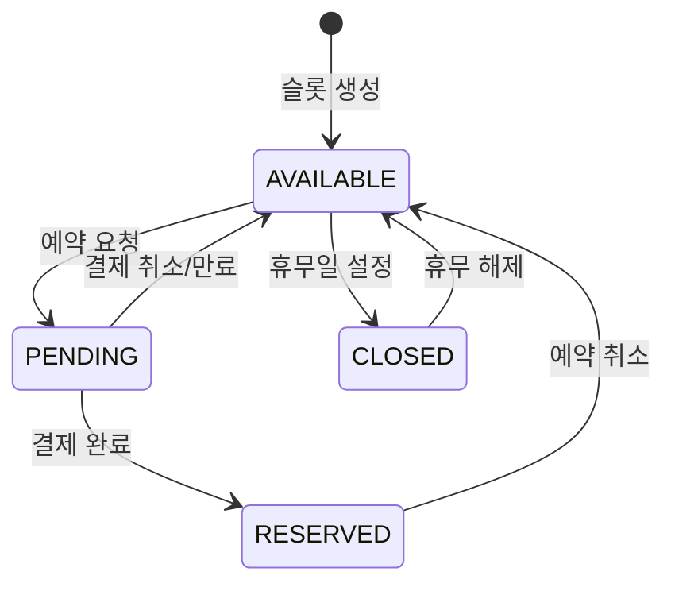
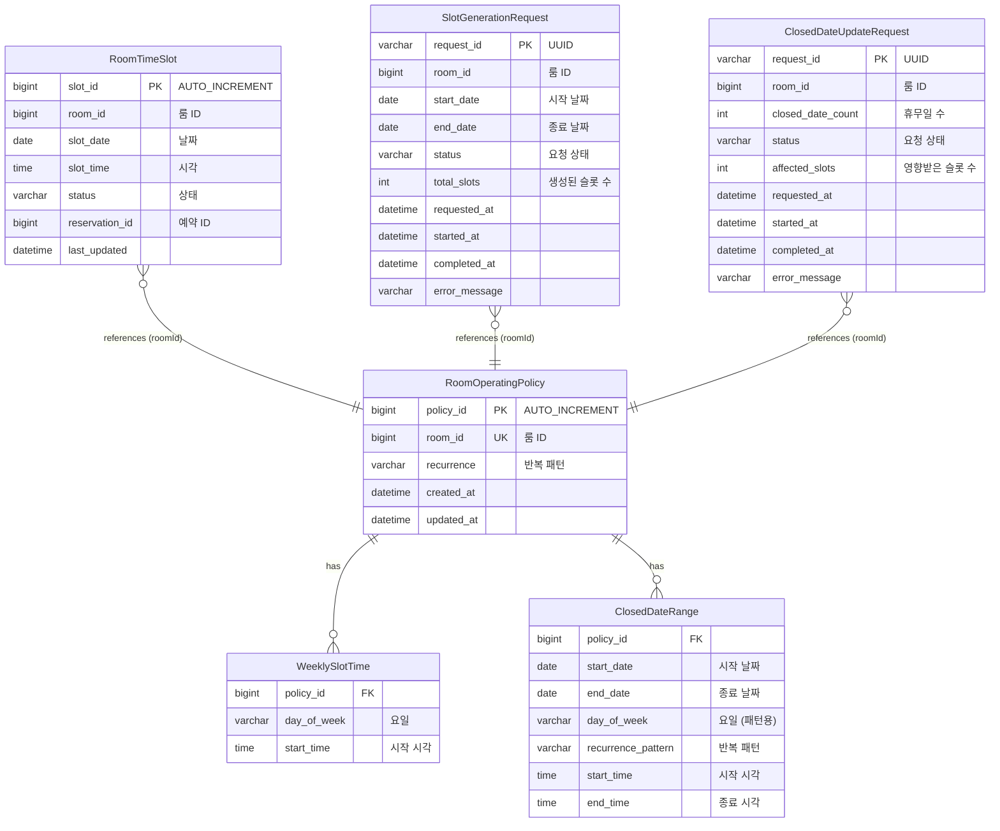

# Room Time Slot Management Service 가이드 문서

## 1. 개요

### 1.1 목적

Room Time Slot Management Service는 음악 스튜디오, 공연장, 연습실 등의 **룸 예약 시스템을 위한 시간 슬롯 관리** 마이크로서비스이다.

### 1.2 주요 기능

| 기능            | 설명                                            |
|---------------|-----------------------------------------------|
| 운영 정책 관리      | 요일별, 시간별, 반복 패턴(매주/홀수주/짝수주) 기반 운영 시간 설정       |
| 시간 슬롯 자동 생성   | Rolling Window 방식으로 항상 30일치 예약 가능 슬롯 유지       |
| 휴무일 관리        | 날짜/시간/패턴 기반 휴무 설정                             |
| 예약 상태 관리      | 슬롯 상태 전이(AVAILABLE → PENDING → RESERVED) 관리 |
| 비동기 대용량 처리    | Kafka 기반 이벤트 드리븐 아키텍처                         |
| 분산 스케줄러       | ShedLock 기반 분산 환경 동시성 제어                      |
| 다중 슬롯 예약      | Pessimistic Lock 기반 동시성 보장                    |
| API 문서         | Swagger UI (SpringDoc OpenAPI)                  |
| 권한 관리         | AOP 기반 PLACE_MANAGER 권한 검증                    |

### 1.3 기술 스택

| 구분             | 기술                                  |
|----------------|-------------------------------------|
| Framework      | Spring Boot 3.5.7                   |
| Language       | Java 17 (LTS)                       |
| Database       | MariaDB 11.x                        |
| Cache          | Redis 7.x                           |
| Message Broker | Apache Kafka                        |
| 분산 락           | ShedLock (Redis Provider)           |
| Build Tool     | Gradle                              |
| API Doc        | SpringDoc OpenAPI 2.3.0             |
| Architecture   | DDD + Hexagonal + CQRS              |

---

## 2. 시스템 아키텍처

### 2.1 전체 구조



### 2.2 레이어 아키텍처



### 2.3 슬롯 생성 흐름



### 2.4 예약 처리 흐름



### 2.5 슬롯 상태 전이



---

## 3. 데이터 모델

### 3.1 ERD



### 3.2 테이블 상세

#### RoomOperatingPolicy (운영 정책)

| 필드         | 타입           | 필수 | 설명              |
|------------|--------------|----|-----------------|
| policy_id  | BIGINT       | Y  | PK, AUTO_INCREMENT |
| room_id    | BIGINT       | Y  | UK, 룸 ID         |
| recurrence | VARCHAR(50)  | N  | 기본 반복 패턴        |
| created_at | DATETIME(6)  | N  | 생성 시간           |
| updated_at | DATETIME(6)  | N  | 수정 시간           |

#### RoomTimeSlot (시간 슬롯)

| 필드             | 타입           | 필수 | 설명                            |
|----------------|--------------|----|---------------------------------|
| slot_id        | BIGINT       | Y  | PK, AUTO_INCREMENT              |
| room_id        | BIGINT       | Y  | 룸 ID                            |
| slot_date      | DATE         | Y  | 슬롯 날짜                          |
| slot_time      | TIME         | Y  | 슬롯 시각                          |
| status         | VARCHAR(20)  | Y  | AVAILABLE, PENDING, RESERVED, CLOSED |
| reservation_id | BIGINT       | N  | 예약 ID                           |
| last_updated   | DATETIME(6)  | N  | 마지막 수정 시간                      |

#### SlotGenerationRequest (슬롯 생성 요청)

| 필드            | 타입            | 필수 | 설명                               |
|---------------|---------------|----|------------------------------------|
| request_id    | VARCHAR(36)   | Y  | PK, UUID                          |
| room_id       | BIGINT        | Y  | 룸 ID                              |
| start_date    | DATE          | Y  | 생성 시작 날짜                         |
| end_date      | DATE          | Y  | 생성 종료 날짜                         |
| status        | VARCHAR(20)   | Y  | REQUESTED, IN_PROGRESS, COMPLETED, FAILED |
| total_slots   | INT           | N  | 생성된 슬롯 수                         |
| requested_at  | DATETIME(6)   | N  | 요청 시각                            |
| started_at    | DATETIME(6)   | N  | 처리 시작 시각                         |
| completed_at  | DATETIME(6)   | N  | 완료 시각                            |
| error_message | VARCHAR(1000) | N  | 에러 메시지 (FAILED 시)                |

### 3.3 Enum 정의

#### SlotStatus (슬롯 상태)

| 값         | 설명                   |
|-----------|----------------------|
| AVAILABLE | 예약 가능                |
| PENDING   | 예약 대기 (결제 진행 중)      |
| RESERVED  | 예약 확정                |
| CLOSED    | 휴무 (예약 불가)           |

#### RecurrencePattern (반복 패턴)

| 값          | 설명                 |
|------------|----------------------|
| EVERY_WEEK | 매주 반복               |
| ODD_WEEK   | 홀수 주차만 (ISO 8601 기준) |
| EVEN_WEEK  | 짝수 주차만              |

#### GenerationStatus (요청 상태)

| 값           | 설명   |
|-------------|------|
| REQUESTED   | 요청됨  |
| IN_PROGRESS | 처리 중 |
| COMPLETED   | 완료   |
| FAILED      | 실패   |

---

## 4. API 명세

### 4.0 API 문서 및 인증

#### Swagger UI

API 문서는 Swagger UI를 통해 확인할 수 있다.

```
GET /swagger-ui/index.html
```

#### 인증 헤더

| 헤더         | 설명                         | 필수 |
|------------|----------------------------|----|
| X-App-Type | 앱 타입 (GENERAL, PLACE_MANAGER) | 조건부 |
| X-User-Id  | 사용자 ID                     | N  |

#### 권한 요구사항

| 권한            | 설명                           | 대상 API                                     |
|---------------|------------------------------|---------------------------------------------|
| PLACE_MANAGER | 룸 관리자 전용 (등록/수정/삭제)           | POST /api/rooms/setup                       |
|               |                              | POST /api/rooms/setup/closed-dates          |
|               |                              | POST /api/rooms/setup/{roomId}/ensure-slots |
|               |                              | PUT /api/rooms/setup/operating-hours        |
| GENERAL       | 일반 사용자 (조회/예약)               | 그 외 모든 API                                  |

**권한 검증 실패 시 응답:**

| HTTP Status | 조건                     | 에러 코드        |
|-------------|------------------------|--------------|
| 400         | X-App-Type 헤더 누락        | VALIDATION_002 |
| 403         | PLACE_MANAGER 권한 필요한 API에 GENERAL로 접근 | AUTH_003     |

### 4.1 룸 설정 API

#### 운영 정책 설정 및 슬롯 생성

```
POST /api/rooms/setup
```

**Request**

| 필드                          | 타입             | 필수 | 설명                             |
|-----------------------------|----------------|----|---------------------------------|
| roomId                      | Long           | Y  | 룸 ID                            |
| slots                       | Array          | Y  | 요일별 슬롯 설정                       |
| slots[].dayOfWeek           | String         | Y  | 요일 (MONDAY ~ SUNDAY)            |
| slots[].startTimes          | Array<String>  | Y  | 시작 시각 목록 (HH:mm)                |
| slots[].recurrencePattern   | String         | Y  | 반복 패턴                           |

**Request Example**

```json
{
  "roomId": 101,
  "slots": [
    {
      "dayOfWeek": "MONDAY",
      "startTimes": ["09:00", "10:00", "11:00"],
      "recurrencePattern": "EVERY_WEEK"
    },
    {
      "dayOfWeek": "TUESDAY",
      "startTimes": ["14:00", "15:00"],
      "recurrencePattern": "EVERY_WEEK"
    }
  ]
}
```

**Response (202 Accepted)**

```json
{
  "requestId": "550e8400-e29b-41d4-a716-446655440000",
  "roomId": 101,
  "startDate": "2025-01-17",
  "endDate": "2025-02-16",
  "status": "REQUESTED",
  "requestedAt": "2025-01-17T10:30:00"
}
```

#### 슬롯 생성 상태 조회

```
GET /api/rooms/setup/{requestId}/status
```

**Path Parameters**

| 파라미터      | 타입     | 필수 | 설명         |
|-----------|--------|----|------------|
| requestId | String | Y  | 슬롯 생성 요청 ID |

**Response (200 OK)**

```json
{
  "requestId": "550e8400-e29b-41d4-a716-446655440000",
  "roomId": 101,
  "status": "COMPLETED",
  "totalSlotsGenerated": 150,
  "startDate": "2025-01-17",
  "endDate": "2025-02-16",
  "requestedAt": "2025-01-17T10:30:00",
  "completedAt": "2025-01-17T10:31:00"
}
```

#### 휴무일 설정

```
POST /api/rooms/setup/closed-dates
```

**Request**

| 필드                       | 타입     | 필수 | 설명               |
|--------------------------|--------|----|-------------------|
| roomId                   | Long   | Y  | 룸 ID              |
| closedDates              | Array  | Y  | 휴무일 목록            |
| closedDates[].startDate  | String | Y  | 시작 날짜 (yyyy-MM-dd) |
| closedDates[].endDate    | String | Y  | 종료 날짜             |
| closedDates[].startTime  | String | N  | 시작 시각 (null=종일)   |
| closedDates[].endTime    | String | N  | 종료 시각             |
| closedDates[].reason     | String | N  | 휴무 사유             |

**Request Example**

```json
{
  "roomId": 101,
  "closedDates": [
    {
      "startDate": "2025-01-01",
      "endDate": "2025-01-01",
      "reason": "신정"
    },
    {
      "startDate": "2025-02-10",
      "endDate": "2025-02-10",
      "startTime": "14:00",
      "endTime": "18:00",
      "reason": "임시 휴무"
    }
  ]
}
```

**Response (202 Accepted)**

```json
{
  "requestId": "660e8400-e29b-41d4-a716-446655440001",
  "roomId": 101,
  "closedDateCount": 2,
  "status": "REQUESTED",
  "requestedAt": "2025-01-17T10:30:00"
}
```

#### 슬롯 보완 생성

```
POST /api/rooms/setup/{roomId}/ensure-slots
```

**Path Parameters**

| 파라미터   | 타입   | 필수 | 설명   |
|--------|------|----|------|
| roomId | Long | Y  | 룸 ID |

**Response (200 OK)**

```json
{
  "roomId": 101,
  "generatedCount": 45
}
```

#### 운영 시간 업데이트

```
PUT /api/rooms/setup/operating-hours
```

**Request**

| 필드                          | 타입             | 필수 | 설명                             |
|-----------------------------|----------------|----|---------------------------------|
| roomId                      | Long           | Y  | 룸 ID                            |
| slots                       | Array          | Y  | 요일별 슬롯 설정                       |
| slots[].dayOfWeek           | String         | Y  | 요일 (MONDAY ~ SUNDAY)            |
| slots[].startTimes          | Array<String>  | Y  | 시작 시각 목록 (HH:mm)                |
| slots[].recurrencePattern   | String         | Y  | 반복 패턴                           |
| slotUnit                    | String         | N  | 슬롯 단위 (HOUR, HALF_HOUR)         |

**Request Example**

```json
{
  "roomId": 101,
  "slots": [
    {
      "dayOfWeek": "MONDAY",
      "startTimes": ["10:00", "11:00", "14:00"],
      "recurrencePattern": "EVERY_WEEK"
    }
  ],
  "slotUnit": "HOUR"
}
```

**Response (202 Accepted)**

```json
{
  "requestId": "770e8400-e29b-41d4-a716-446655440002",
  "roomId": 101
}
```

**특징**
- 기존 AVAILABLE 슬롯만 삭제 후 재생성
- CLOSED, RESERVED, PENDING 슬롯은 유지
- 비동기 처리 (Kafka 이벤트 발행)

### 4.2 예약 API

#### 예약 가능 슬롯 조회

```
GET /api/v1/reservations/available-slots
```

**Query Parameters**

| 파라미터   | 타입     | 필수 | 설명             |
|--------|--------|----|-----------------|
| roomId | Long   | Y  | 룸 ID            |
| date   | String | Y  | 조회 날짜 (yyyy-MM-dd) |

**Response (200 OK)**

```json
[
  {
    "slotId": 12345,
    "roomId": 101,
    "slotDate": "2025-01-20",
    "slotTime": "09:00",
    "status": "AVAILABLE"
  },
  {
    "slotId": 12346,
    "roomId": 101,
    "slotDate": "2025-01-20",
    "slotTime": "10:00",
    "status": "AVAILABLE"
  }
]
```

#### 단일 슬롯 예약

```
POST /api/v1/reservations
```

**Request**

| 필드            | 타입     | 필수 | 설명               |
|---------------|--------|----|-------------------|
| roomId        | Long   | Y  | 룸 ID              |
| slotDate      | String | Y  | 슬롯 날짜 (yyyy-MM-dd) |
| slotTime      | String | Y  | 슬롯 시각 (HH:mm)     |
| reservationId | Long   | Y  | 예약 ID (외부 시스템 생성) |

**Request Example**

```json
{
  "roomId": 101,
  "slotDate": "2025-01-20",
  "slotTime": "14:00",
  "reservationId": 567890123456789
}
```

**Response (200 OK)**

```
(Empty Body)
```

#### 다중 슬롯 예약

```
POST /api/v1/reservations/multi
```

**Request**

| 필드        | 타입             | 필수 | 설명               |
|-----------|----------------|----|--------------------|
| roomId    | Long           | Y  | 룸 ID               |
| slotDate  | String         | Y  | 슬롯 날짜 (yyyy-MM-dd) |
| slotTimes | Array<String>  | Y  | 슬롯 시각 목록 (HH:mm)   |

**Request Example**

```json
{
  "roomId": 101,
  "slotDate": "2025-01-20",
  "slotTimes": ["14:00", "15:00", "16:00"]
}
```

**Response (200 OK)**

```json
{
  "reservationId": 567890123456789,
  "roomId": 101,
  "slotDate": "2025-01-20",
  "reservedSlotTimes": ["14:00", "15:00", "16:00"]
}
```

**특징**
- Snowflake ID 자동 생성
- Pessimistic Lock (`SELECT FOR UPDATE`)으로 동시성 제어
- 하나라도 예약 불가 시 전체 롤백

### 4.3 API 엔드포인트 요약

| 카테고리   | 메서드  | 엔드포인트                               | 설명         | 권한           |
|--------|------|-------------------------------------|------------|--------------|
| 룸 설정   | POST | `/api/rooms/setup`                  | 운영 정책 설정   | PLACE_MANAGER |
|        | GET  | `/api/rooms/setup/{requestId}/status` | 생성 상태 조회   | -            |
|        | POST | `/api/rooms/setup/closed-dates`     | 휴무일 설정     | PLACE_MANAGER |
|        | POST | `/api/rooms/setup/{roomId}/ensure-slots` | 슬롯 보완 생성   | PLACE_MANAGER |
|        | PUT  | `/api/rooms/setup/operating-hours`  | 운영 시간 수정   | PLACE_MANAGER |
| 예약     | GET  | `/api/v1/reservations/available-slots` | 가용 슬롯 조회   | -            |
|        | POST | `/api/v1/reservations`              | 단일 슬롯 예약   | -            |
|        | POST | `/api/v1/reservations/multi`        | 다중 슬롯 예약   | -            |

---

## 5. 이벤트 명세

### 5.1 Kafka Topics

| Topic                          | Producer     | Consumer     | 설명            |
|--------------------------------|--------------|--------------|---------------|
| slot-generation-requested      | Slot Service | Slot Service | 슬롯 생성 요청      |
| closed-date-update-requested   | Slot Service | Slot Service | 휴무일 업데이트 요청   |
| slot-reserved                  | Slot Service | External     | 슬롯 예약 완료      |
| slot-cancelled                 | Slot Service | External     | 슬롯 취소         |
| slot-restored                  | Slot Service | External     | 슬롯 복구         |
| payment-completed              | External     | Slot Service | 결제 완료 (슬롯 확정) |
| payment-cancelled              | External     | Slot Service | 결제 취소 (슬롯 복구) |
| reservation-cancelled          | External     | Slot Service | 예약 취소 (슬롯 해제) |

### 5.2 이벤트 페이로드

#### SlotGenerationRequestedEvent

```json
{
  "eventType": "SLOT_GENERATION_REQUESTED",
  "timestamp": "2025-01-17T10:30:00Z",
  "payload": {
    "requestId": "550e8400-e29b-41d4-a716-446655440000",
    "roomId": 101,
    "startDate": "2025-01-17",
    "endDate": "2025-02-16"
  }
}
```

#### SlotReservedEvent

```json
{
  "eventType": "SLOT_RESERVED",
  "timestamp": "2025-01-17T11:00:00Z",
  "payload": {
    "reservationId": 567890123456789,
    "roomId": 101,
    "slotDate": "2025-01-20",
    "slotTimes": ["14:00", "15:00", "16:00"]
  }
}
```

#### PaymentCompletedEvent

```json
{
  "eventType": "PAYMENT_COMPLETED",
  "timestamp": "2025-01-17T11:05:00Z",
  "payload": {
    "reservationId": 567890123456789,
    "paymentId": "PAY-123456"
  }
}
```

---

## 6. 비즈니스 규칙

### 6.1 슬롯 생성 규칙

| 규칙             | 설명                              |
|----------------|---------------------------------|
| Rolling Window | 항상 오늘 기준 30일 후까지 슬롯 유지          |
| 반복 패턴 적용       | EVERY_WEEK, ODD_WEEK, EVEN_WEEK |
| 휴무일 제외         | 휴무 설정된 날짜/시간은 CLOSED 상태로 생성     |
| 중복 방지          | 이미 존재하는 슬롯은 재생성하지 않음            |

### 6.2 예약 규칙

| 규칙            | 설명                          |
|---------------|-----------------------------|
| AVAILABLE만 예약 | AVAILABLE 상태 슬롯만 예약 가능       |
| 동시성 제어        | Pessimistic Lock으로 동시 예약 방지 |
| 원자적 처리        | 다중 슬롯 예약 시 전체 성공 또는 전체 롤백   |
| 자동 만료         | PENDING 상태 40분 후 자동 AVAILABLE 복귀 |

### 6.3 휴무일 규칙

| 규칙         | 설명                                    |
|------------|---------------------------------------|
| 종일 휴무      | startTime/endTime null 시 종일 휴무        |
| 시간대 휴무     | 특정 시간만 CLOSED                         |
| 패턴 휴무      | 반복 패턴 + 요일 조합 (매주 월요일 09:00~10:00 등) |
| 기존 슬롯 업데이트 | 휴무 설정 시 기존 AVAILABLE 슬롯 CLOSED로 변경   |

---

## 7. 인덱스 설계

### 7.1 RoomTimeSlot 인덱스

```sql
-- 룸별 날짜/시간 조회 (가장 빈번한 쿼리)
CREATE INDEX idx_room_date_time ON room_time_slots (room_id, slot_date, slot_time);

-- 날짜 범위 + 상태 필터
CREATE INDEX idx_date_status ON room_time_slots (slot_date, status);

-- 과거 데이터 정리용
CREATE INDEX idx_cleanup ON room_time_slots (slot_date);
```

### 7.2 SlotGenerationRequest 인덱스

```sql
-- 룸별 요청 조회
CREATE INDEX idx_request_room_id ON slot_generation_requests (room_id);

-- 상태별 조회
CREATE INDEX idx_request_status ON slot_generation_requests (status);
```

---

## 8. 에러 코드

### 8.1 Slot 관련 (SLOT_0XX)

| 코드       | HTTP Status | 설명             |
|----------|-------------|----------------|
| SLOT_001 | 404         | 슬롯을 찾을 수 없음    |
| SLOT_002 | 409         | 슬롯이 예약 불가능     |
| SLOT_003 | 409         | 슬롯이 이미 예약됨     |
| SLOT_004 | 400         | 잘못된 상태 전이      |

### 8.2 Policy 관련 (POLICY_0XX)

| 코드         | HTTP Status | 설명             |
|------------|-------------|----------------|
| POLICY_001 | 404         | 운영 정책을 찾을 수 없음 |
| POLICY_002 | 409         | 운영 정책이 이미 존재   |
| POLICY_003 | 400         | 잘못된 스케줄 설정     |

### 8.3 Time 관련 (TIME_0XX)

| 코드       | HTTP Status | 설명        |
|----------|-------------|-----------|
| TIME_001 | 400         | 잘못된 시간 범위 |
| TIME_002 | 400         | 과거 날짜 불허  |
| TIME_003 | 500         | 슬롯 생성 실패  |

---

## 9. 환경 설정

### 9.1 환경 변수

```bash
# Database
DATABASE_HOST=localhost
DATABASE_PORT=3306
DATABASE_NAME=slot_db
DATABASE_USER_NAME=slot_user
DATABASE_PASSWORD=your_password

# Redis
REDIS_HOST=localhost
REDIS_PORT=6379

# Kafka
KAFKA_URL1=localhost:9092
KAFKA_URL2=localhost:9093
KAFKA_URL3=localhost:9094

# Application
SPRING_PROFILES_ACTIVE=dev
ROLLING_WINDOW_DAYS=30
```

### 9.2 application.yml 예시

```yaml
spring:
  datasource:
    url: jdbc:mariadb://${DATABASE_HOST}:${DATABASE_PORT}/${DATABASE_NAME}
    username: ${DATABASE_USER_NAME}
    password: ${DATABASE_PASSWORD}

  jpa:
    hibernate:
      ddl-auto: validate
    show-sql: false

  data:
    redis:
      host: ${REDIS_HOST}
      port: ${REDIS_PORT}

  kafka:
    bootstrap-servers: ${KAFKA_URL1},${KAFKA_URL2},${KAFKA_URL3}
    consumer:
      group-id: slot-service-group
      auto-offset-reset: earliest

room:
  timeSlot:
    rollingWindow:
      days: ${ROLLING_WINDOW_DAYS:30}
```

### 9.3 Docker 배포

#### Dockerfile

```dockerfile
FROM eclipse-temurin:17-jre-jammy

WORKDIR /app

COPY build/libs/*.jar /app/app.jar

EXPOSE 8080

ENTRYPOINT ["java", "-jar", "/app/app.jar"]
```

#### Docker Compose

```yaml
version: '3.8'

services:
  slot-service:
    image: slot-service:latest
    ports:
      - "8080:8080"
    environment:
      - SPRING_PROFILES_ACTIVE=prod
      - DATABASE_HOST=mariadb
      - DATABASE_PORT=3306
      - DATABASE_NAME=slot_db
      - DATABASE_USER_NAME=${DB_USER}
      - DATABASE_PASSWORD=${DB_PASSWORD}
      - REDIS_HOST=redis
      - REDIS_PORT=6379
      - KAFKA_URL1=kafka:9092
    depends_on:
      - mariadb
      - redis
      - kafka

  mariadb:
    image: mariadb:11.3
    environment:
      MYSQL_ROOT_PASSWORD: ${DB_ROOT_PASSWORD}
      MYSQL_DATABASE: slot_db
      MYSQL_USER: ${DB_USER}
      MYSQL_PASSWORD: ${DB_PASSWORD}
    volumes:
      - mariadb_data:/var/lib/mysql

  redis:
    image: redis:7-alpine
    ports:
      - "6379:6379"

volumes:
  mariadb_data:
```

---

## 10. 스케줄링

### 10.1 스케줄 작업

| 작업        | 크론 표현식        | 설명                |
|-----------|---------------|-------------------|
| 일일 슬롯 생성  | `0 0 0 * * *` | 매일 자정 익일 슬롯 생성    |
| 과거 슬롯 정리  | `0 0 3 * * *` | 매일 03시 과거 슬롯 삭제   |
| 만료 PENDING | `0 */10 * * * *` | 10분마다 만료된 PENDING 복구 |

### 10.2 ShedLock 설정

```java
@Scheduled(cron = "0 0 0 * * *")
@SchedulerLock(
    name = "generateDailySlotsTask",
    lockAtMostFor = "10m",
    lockAtLeastFor = "5m"
)
public void generateDailySlots() {
    // 슬롯 생성 로직
}
```

---

## 11. 테스트

### 11.1 테스트 분류

| 계층          | 테스트 대상                      | 테스트 유형   |
|-------------|-----------------------------| -------- |
| Domain      | Entity, Value Object, Enum  | Unit     |
| Service     | Domain Service              | Unit     |
| Application | Application Service         | Integration |
| Infrastructure | JPA Adapter, Repository  | Integration |

### 11.2 테스트 실행

```bash
# 전체 테스트
./gradlew test

# 특정 테스트 실행
./gradlew test --tests RoomOperatingPolicyTest

# 테스트 리포트
./gradlew test jacocoTestReport
```

---

## 12. 프로젝트 구조

```
src/main/java/com/teambind/springproject/
├── SpringProjectApplication.java
├── common/
│   ├── config/          # 공통 설정 (Redis, JPA, ShedLock)
│   ├── event/           # 도메인 이벤트 퍼블리셔
│   ├── exceptions/      # 예외 처리
│   └── util/            # 유틸리티 (ID Generator, JSON)
├── config/              # 앱 설정 (Async, Scheduling)
├── message/
│   ├── consume/         # Kafka Consumer
│   ├── dto/             # 이벤트 메시지 DTO
│   ├── handler/         # 이벤트 핸들러
│   ├── outbox/          # Outbox 패턴
│   └── publish/         # Kafka Producer
└── room/
    ├── command/
    │   ├── application/ # Command Application Services
    │   ├── domain/      # Domain Services
    │   └── dto/         # Command DTOs
    ├── controller/      # REST Controllers
    ├── domain/port/     # Port Interfaces
    ├── entity/          # JPA Entities
    │   ├── enums/       # Enums
    │   └── vo/          # Value Objects
    ├── event/           # 도메인 이벤트
    ├── infrastructure/  # JPA Adapters
    ├── mapper/          # DTO Mappers
    ├── query/
    │   ├── application/ # Query Application Services
    │   └── dto/         # Query DTOs
    ├── repository/      # JPA Repositories
    └── scheduler/       # 스케줄러
```

---

## 13. 참고 문서

| 문서                            | 설명            |
|-------------------------------|---------------|
| [API 명세서](docs/API-SPECIFICATION.md) | 상세 API 명세     |
| [아키텍처 개요](docs/00-ARCHITECTURE-OVERVIEW.md) | 시스템 아키텍처 설명   |
| [개발 환경 설정](docs/01-DEVELOPMENT-SETUP.md) | 로컬 개발 환경 구성   |
| [ADR](docs/adr/)              | 아키텍처 결정 기록    |
| [가이드](docs/guides/)           | 설정 및 사용 가이드   |

---

**Version**: 1.2.0
**Team**: Teambind_dev_backend Team
**Maintainer**: DDINGJOO
**Last Updated**: 2025-01-05
**License**: Proprietary